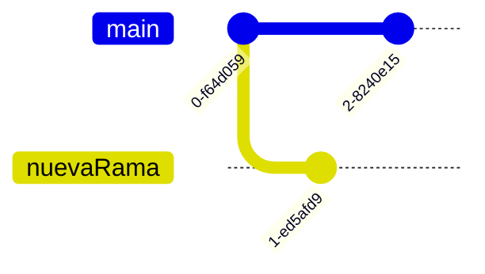

# Comandos

### Inicializar un proyecto de git

`git init`

### agrega archivos para seguimiento

`git add *.md`
`git add Comandos.md`

### Estatus de los archivos en git


### Revisar el estatus de los archivos

```bash
git status
On branch master
Your branch is up-to-date with 'origin/master'.
nothing to commit, working tree clean

```

agregar un archivo README.md

```bash
git status
On branch master
Your branch is up-to-date with 'origin/master'.
Untracked files:
  (use "git add <file>..." to include in what will be committed)
  README
nothing added to commit but untracked files present (use "git add" to track)

```

#### Comenzar a rastrear nuevos archivos (incluirlos en la foto)

`git add README`

```bash

$ git status
On branch master
Your branch is up-to-date with 'origin/master'.
Changes to be committed:
29
  (use "git restore --staged <file>..." to unstage)
  new file: README

```

agregar un archivo README.md

```bash

$ git status
On branch master
Your branch is up-to-date with 'origin/master'.
Changes to be committed:
  (use "git reset HEAD <file>..." to unstage)
  new file: README
Changes not staged for commit:
  (use "git add <file>..." to update what will be committed)
  (use "git checkout -- <file>..." to discard changes in working directory)
  modified: CONTRIBUTING.md


```

agregar el archivo CONTRIBUTING a trackeo y commit

```bash

$ git add CONTRIBUTING.md
$ git status
On branch master
Your branch is up-to-date with 'origin/master'.
Changes to be committed:
  (use "git reset HEAD <file>..." to unstage)
  new file: README
30
  modified: CONTRIBUTING.md

```

#### Comenzar a rastrear nuevos archivos (incluirlos en la foto)

```bash

$ git status -s
$ git status --short

M README
MM Rakefile
A lib/git.rb
M lib/simplegit.rb
?? LICENSE.txt

```

M - modificado
A - agregado
?? - sin trackeo

MM - primera columna en stage, segunda fuera del stage

### Remover un archivo del trackeo

```bash

git rm contribution

```

## Revisar el log del repositorio

```bash

git log
git log -p  muestra los cambios en los commits
git log --pretty[=short|full|fuller]
git log --prett[=format:]

```

|formato|descripcion|
|--|--|
|%H|Commit hash|
|%h|Abbreviated commit hash|
|%T|Tree hash|
|%t|Abbreviated tree hash|
|%P|Parent hashes|
|%p|Abbreviated parent hashes|
|%an|Author name|
|%ae|Author email|
|%ad|Author date (format respects the --date=option)|
|%ar|Author date, relative|
|%cn|Committer name|
|%ce|Committer email|
|%cd|Committer date|
|%cr|Committer date, relative|
|%s|Subject|

```bash

git log --pretty=format:"%h %s" --graph

```

| Option           | Description                                                                                       |
|------------------|---------------------------------------------------------------------------------------------------|
| -p               | Muestra el comentario de cada commit.|
| --stat           | Muestra las estadisticas de los commits.|
| --shortstat      | Muestra solo los cambios/inserciones/eliminaciones.|
| --name-only      | Muestra la lista de archivos modificados |
| --name-status    | Muestra la lista de archivos modificados con los cambios/inserciones/eliminaciones|
| --abbrev-commit  | Muestra solo los primeros caracteres del SHA1.|
| --relative-date  | Muestra la fecha en un formato realativo (hace 2 semanas) |
| --graph          | Muestra la grafica de las ramas y los merge|
| --pretty         | Muestra los commits en un formato alternativo. Los valores incluidos pueden ser oneline, short, full, fuller, y format |
| --oneline        | Shorthand for --pretty=oneline --abbrev-commit used together.                                     |


### Muestra los commits y el numero de ocurrencias donde se modifico la cadena

```bash

git log -S function_name

```

### Muestra los commits de un archivo

```bash

git log -- path/to/file

```

| Opción       | Descripción                                                                 |
|--------------|-----------------------------------------------------------------------------|
| -<n>         | Mostrar solo los últimos n commits.                                         |
| --since, --after | Limitar los commits a aquellos realizados después de la fecha especificada. |
| --until, --before | Limitar los commits a aquellos realizados antes de la fecha especificada.   |
| --author     | Mostrar solo commits en los que la entrada del autor coincida con la cadena especificada. |
| --committer  | Mostrar solo commits en los que la entrada del committer coincida con la cadena especificada. |
| --grep       | Mostrar solo commits con un mensaje de commit que contenga la cadena.       |
| -S           | Mostrar solo commits que agreguen o eliminen código que coincida con la cadena. |


### Sacar un archivo del stage

```bash

git restore --staged README.md

```

### Ver remotos del repositorio

```bash
git remote -v
```

### ver log con ramas

```bash
git log --oneline --decorate
```



```bash
git log --oneline --decorate --all --graph
```

---

Se realizara un cambio en la rama maestra, por lo cual hay que cambiarse a esta, realizar el cambio y hacer el commit

```bash
git checkout master
```
### Agregar remoto al repositorio

```bash
git remote add [nombreCorto] [url]
```

### Hacer push a un remoto

```bash
git push origin master
```

### Crear una nueva rama

```bash
git branch nuevaRama
```

### Crear una nueva rama y cambiarse a esta

```bash
git checkout - b nuevaRama
```

### Hacer merge a una rama

```bash
git checkout master
git merge hotFix
```

### Eliminar una rama(local)

```bash
git branch -d hotFix
```

### Eliminar una rama(remota)

```bash
git push origin --delete hotFix nuevaRama
```
