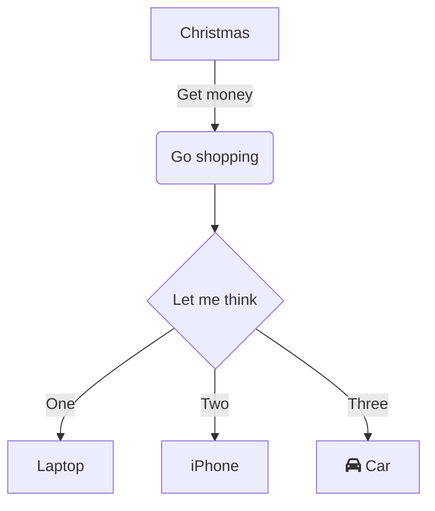
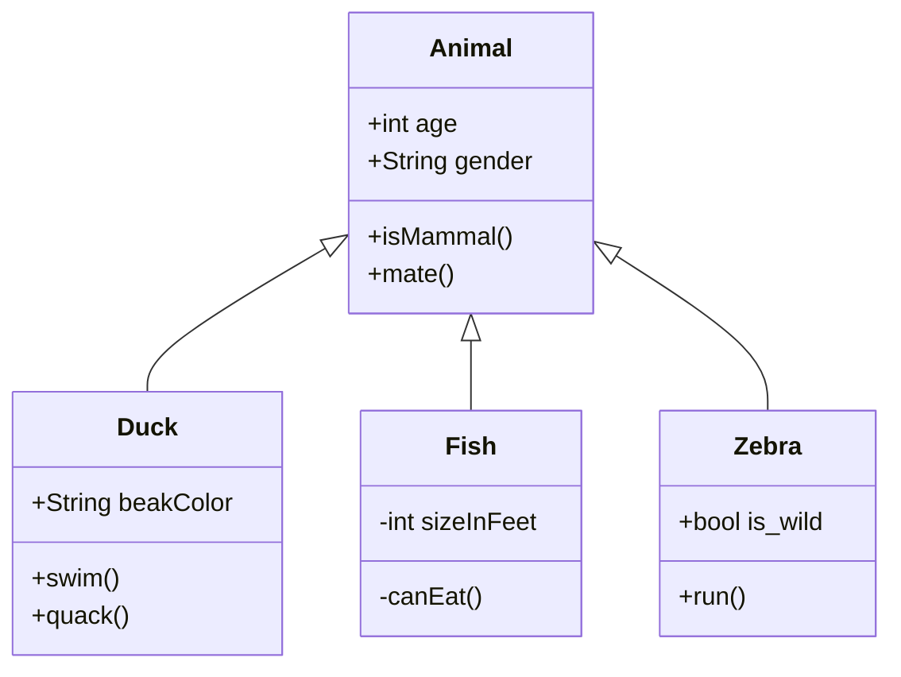
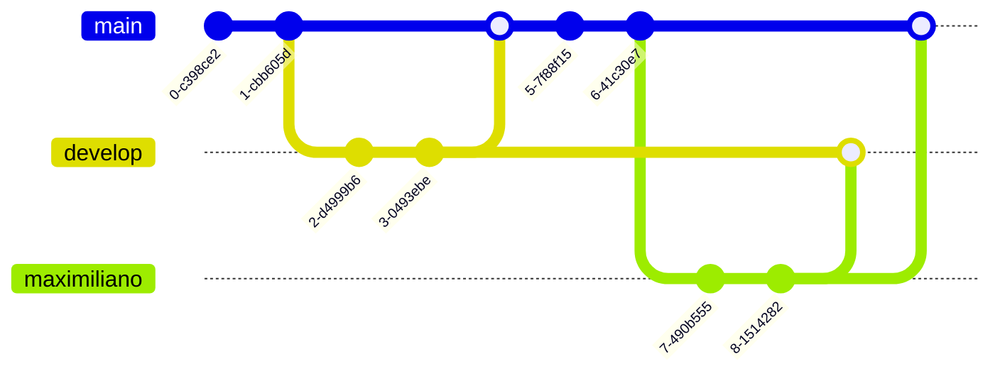

## Elementos de bloque

### Parrafos y saltos de línea

Para generar un nuevo parrafo se deberá separar el texto mediante una linea en blanco.

Markdown no soporta dobles lineas en blanco, al procesarse el texto se convertiran en una sola.

Para realizar un salto de linea dentro del mismo parrafo se deben dejar dos espacios en blanco al final de la linea.

"Andando con  sus patitas mojadas__  
el gorrión__  
por la terraza de madera"

---

### Encabezados

# Encabezado 1

## Encabezado 2

### Encabezado 3

#### Encabezado 4

##### Encabezado 5

###### Encabezado 6

---

### Citas

Las citas se generan usando el simbolo mayor que al principio del bloque de texto

> Un país, una civilización se puede juzgar por la forma en que trata a sus animales.  — Mahatma Gandhi

Una cita con varios parrafos deberá constar de texto con el simbolo al principio de cada bloque de texto

> Creo que los animales ven en el hombre un ser igual a ellos que ha perdido de forma extraordinariamente peligrosa el sano intelecto animal.
> Es decir, que ven en él al animal irracional, al animal que ríe, al animal que llora, al animal infeliz. — Friedrich Nietzsche

citas anidadas

> Esto sería una cita como la que acabas de ver.
>
> > Dentro de ella puedes anidar otra cita.
>
> La cita principal llegaría hasta aquí.

---

### Listas

#### Listas desordenadas

Para crear una lista desordenada se utiliza * - ó +

- Elemento de lista 1
- Elemento de lista 2
* Elemento de lista 3
* Elemento de lista 4
+ Elemento de lista 5
+ Elemento de lista 6

Para crear una lista anidada se deben dejar cuatro espacios antes del siguiente elemento

-Elemento 1
-Elemento 2
    -Elemento 2.1
        -Elemento 2.1.1

#### Listas ordenadas

1. Elemento 1
2. Elemento 2
    1. Elemento 1.1

---

### Bloques de codigo

```bash
Creando códigos de bloque.
Puedes añadir tantas líneas y párrafos como quieras.  
```

---

### Enfasis (negritas y cursivas)

|Markdown|Resultado|
|--|--|
|* cursiva  *|*cursiva*|
|_cursiva _|_cursiva_|
|**negrita **|**negrita**|
|curisva y negrita|***cursiva y negrita***|
|curisva y negrita|___cursiva y negrita___|

---

### Links

Se escriben con el texto dentro de [] y la linga en ()

[Sintaxis markdown](https://markdown.es/sintaxis-markdown/)

---

### Links o enlaces como referencia

Este es un ejemplo de [enlace de referencia][google].

[google]: https://www.google.com

---

### Código

Para escribir codigo se encierra el texto en `

`Esto es código`

---

### Imagenes


---

### Links automáticos

Para mostrar una liga con url completa se encierra en los simbolos mayor que y menor que
<https://www.google.com.mx/>

---

### Omitir Markdown

Para evitar que markdown interprete simbolos se debe colocar una diagonal invertida antes del simbolo que se desea omitir

\*negritas*\

---

### Tablas

|Cabecero1|Cabecero2|
|---|---|
|Dato1|Dato2|
|Dato3|Dato4|

---

## Mermaid

[Mermaid live editor](https://mermaid.live/edit#pako:eNqFjkEKAjEMRa8yZD0n6FrwAO6km9jGtsy0KbEVZJi7G3F0oYhZ_fz_fsgCjj2BgZDaXrBGWwYdxzmn9q1PgsXFwdOVZq5bHslN3NuH--PCm86YytPKJIH-tWEE5bTk9dnlkVhokTJZMCo9ymTBllU57I0Pt-LANOk0gnAPEcwZ54tuvXpstEsYBPMLqViOzHmD1jsh-V03)







---

### Geojson

```geojson
{
  "type": "FeatureCollection",
  "features": [
    {
      "type": "Feature",
      "properties": {},
      "geometry": {
        "coordinates": [
          [
            [
              -99.1561131429656,
              19.354271046115755
            ],
            [
              -99.15612362614428,
              19.354131411975985
            ],
            [
              -99.15591766252156,
              19.35417737489361
            ],
            [
              -99.15597192838622,
              19.354311190909044
            ],
            [
              -99.1561131429656,
              19.354271046115755
            ]
          ]
        ],
        "type": "Polygon"
      }
    }
  ]
}
```

### TopoJSON

```topojson
{
  "type": "Topology",
  "transform": {
    "scale": [0.0005000500050005, 0.00010001000100010001],
    "translate": [100, 0]
  },
  "objects": {
    "example": {
      "type": "GeometryCollection",
      "geometries": [
        {
          "type": "Point",
          "properties": {"prop0": "value0"},
          "coordinates": [4000, 5000]
        },
        {
          "type": "LineString",
          "properties": {"prop0": "value0", "prop1": 0},
          "arcs": [0]
        },
        {
          "type": "Polygon",
          "properties": {"prop0": "value0",
            "prop1": {"this": "that"}
          },
          "arcs": [[1]]
        }
      ]
    }
  },
  "arcs": [[[4000, 0], [1999, 9999], [2000, -9999], [2000, 9999]],[[0, 0], [0, 9999], [2000, 0], [0, -9999], [-2000, 0]]]
}
```

---

### Modelos STL 3D

```stl
solid cube_corner
  facet normal 0.0 -1.0 0.0
    outer loop
      vertex 0.0 0.0 0.0
      vertex 1.0 0.0 0.0
      vertex 0.0 0.0 1.0
    endloop
  endfacet
  facet normal 0.0 0.0 -1.0
    outer loop
      vertex 0.0 0.0 0.0
      vertex 0.0 1.0 0.0
      vertex 1.0 0.0 0.0
    endloop
  endfacet
  facet normal -1.0 0.0 0.0
    outer loop
      vertex 0.0 0.0 0.0
      vertex 0.0 0.0 1.0
      vertex 0.0 1.0 0.0
    endloop
  endfacet
  facet normal 0.577 0.577 0.577
    outer loop
      vertex 1.0 0.0 0.0
      vertex 0.0 1.0 0.0
      vertex 0.0 0.0 1.0
    endloop
  endfacet
endsolid
```

---

## Arbol de carpetas
C:.
├───packages
│   ├───Newtonsoft.Json.13.0.1
│   │   └───lib
│   │       ├───net20
│   │       ├───net35
│   │       ├───net40
│   │       ├───net45
│   │       ├───netstandard1.0
│   │       ├───netstandard1.3
│   │       └───netstandard2.0
│   ├───Selenium.Support.4.17.0
│   │   └───lib
│   │       └───netstandard2.0
│   ├───Selenium.WebDriver.4.17.0
│   │   ├───build
│   │   ├───buildTransitive
│   │   ├───lib
│   │   │   └───netstandard2.0
│   │   └───manager
│   │       ├───linux
│   │       ├───macos
│   │       └───windows
│   └───Selenium.WebDriver.ChromeDriver.121.0.6167.8500
│       ├───build
│       └───driver
│           ├───linux64
│           ├───mac64
│           ├───mac64arm
│           └───win32
└───SeleniumAutomation
    ├───bin
    │   └───Debug
    │       └───selenium-manager
    │           ├───linux
    │           ├───macos
    │           └───windows
    ├───models
    ├───obj
    │   └───Debug
    │       └───TempPE
    └───Properties

